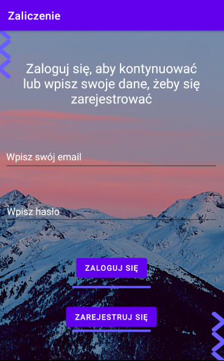
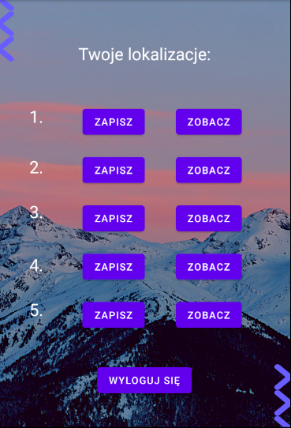
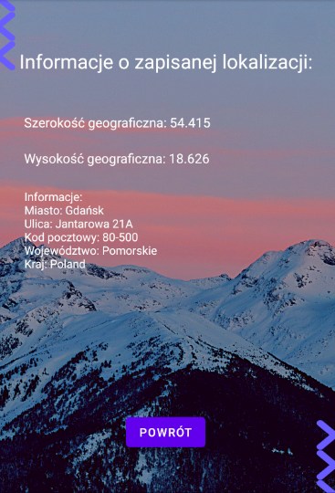

# Simple_Android_App
 Simple Android app with localization and login features.

-->
[![Contributors][contributors-shield]][contributors-url]
[![Forks][forks-shield]][forks-url]
[![Stargazers][stars-shield]][stars-url]
[![Issues][issues-shield]][issues-url]
[![MIT License][license-shield]][license-url]
[![LinkedIn][linkedin-shield]][linkedin-url]

<!-- PROJECT LOGO -->
 

  <h3 align="center">Simple_Android_App</h3>
  

    <a href="https://github.com/DominikDeptula/Simple_Android_App/issues">Report Bug</a>
    
  

<!-- TABLE OF CONTENTS -->

  
Table of Contents

  <ol>
    <li>
      <a href="#about-the-project">About The Project</a>
      <ul>
        <li><a href="#built-with">Built With</a></li>
      </ul>
    </li>
    <li>
      <a href="#getting-started">Getting Started</a>
      <ul>
      </ul>
    </li>
    <li><a href="#contributing">Contributing</a></li>
    <li><a href="#license">License</a></li>
    <li><a href="#contact">Contact</a></li>
  </ol>

<!-- ABOUT THE PROJECT -->
## About The Project

We made this project to pass the classes where we use Android Studio. This simple application allows you to save your location wherever you are. Location coordinates are saved in the database separately for each user. Then you can see the information of the saved location.

 
 
 

(<a href="#top">back to top</a>)

### Built With

* [Java](https://www.java.com)
* [Android Studio](https://developer.android.com)

(<a href="#top">back to top</a>)

<!-- GETTING STARTED -->
## Getting Started

1. Open the project via Android Studio.
2. Click 'Tools' and then choose the 'Firebase' from the dropdown menu.
3. In the assistant window click 'Realtime Database' and then 'Get started with Realtime Database'.
4. Click on the 'Connect to Firebase' button.
5. Connect the project to your Firebase project.
6. You have to enable the Email/Password sign-in provider.
7. The Simple_Android_App is ready to use!

<!-- CONTRIBUTING -->
## Contributing

Contributions are what make the open source community such an amazing place to learn, inspire, and create. Any contributions you make are **greatly appreciated**.

If you have a suggestion that would make this better, please fork the repo and create a pull request. You can also simply open an issue with the tag "enhancement".
Don't forget to give the project a star! Thanks again!

1. Fork the Project
2. Create your Feature Branch (`git checkout -b feature/AmazingFeature`)
3. Commit your Changes (`git commit -m 'Add some AmazingFeature'`)
4. Push to the Branch (`git push origin feature/AmazingFeature`)
5. Open a Pull Request

(<a href="#top">back to top</a>)

<!-- LICENSE -->
## License

Distributed under the MIT License. See `LICENSE` for more information.

(<a href="#top">back to top</a>)

<!-- CONTACT -->
## Contact

Dominik Deptuła - dominikdep05@gmail.com
 
Wojciech Wójcicki - w.wojcicki.745@studms.ug.edu.pl

(<a href="#top">back to top</a>)

